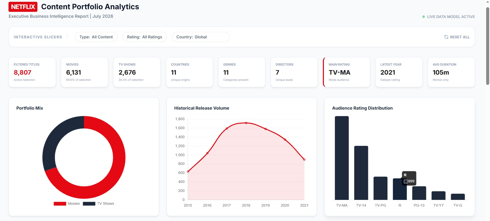
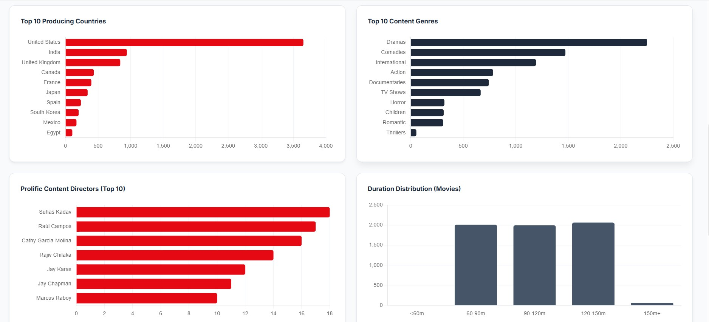
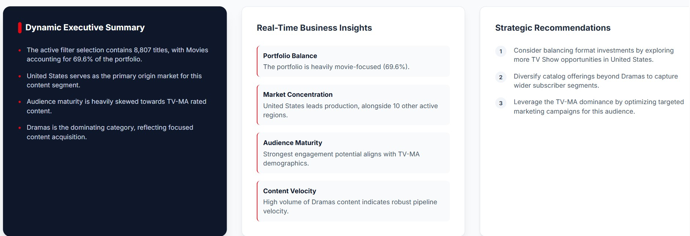

# 🎬 Netflix Content Portfolio Analysis Dashboard

> An interactive Business Analytics dashboard developed as part of my **Business Analytics Internship at Auspify Technologies**. This project analyzes Netflix's content portfolio to uncover business insights through KPI reporting, executive dashboards, data visualization, and interactive analytics.



---

## 📌 Project Overview

This project focuses on analyzing Netflix's global content portfolio using Business Analytics techniques. The objective is to transform raw data into meaningful insights through interactive dashboards, KPI tracking, and executive-level reporting.

The dashboard provides a comprehensive overview of Netflix's content distribution, audience segmentation, production countries, genres, ratings, release trends, and business recommendations.

---

## 🚀 Features

✅ Interactive Executive Dashboard

✅ KPI Summary Cards

✅ Movies vs TV Shows Distribution

✅ Historical Release Trend Analysis

✅ Country-wise Content Analysis

✅ Genre Distribution

✅ Audience Rating Analysis

✅ Director Performance Analysis

✅ Movie Duration Distribution

✅ Dynamic Business Insights

✅ Executive Recommendations

✅ Responsive Dashboard Design

---

## 📊 Dashboard Preview

### Executive Dashboard


---

### Interactive Visualizations



---

### Business Insights



---

## 📈 Key Performance Indicators (KPIs)

The dashboard includes several business KPIs, including:

- Total Netflix Titles
- Movies
- TV Shows
- Countries
- Genres
- Directors
- Average Movie Duration
- Latest Release Year
- Most Common Audience Rating

---

## 📊 Dashboard Visualizations

The dashboard contains multiple interactive charts including:

- Doughnut Chart (Content Mix)
- Line Chart (Release Trend)
- Rating Distribution
- Country-wise Content Analysis
- Genre Distribution
- Director Analysis
- Movie Duration Histogram

---

## 💼 Business Insights Generated

The dashboard automatically generates executive-level insights, including:

- Portfolio composition analysis
- Content acquisition trends
- Audience targeting strategy
- Market concentration analysis
- Content growth evaluation
- Strategic business recommendations

---

## 🛠 Technologies Used

- Microsoft Excel
- Business Analytics
- Dashboard Design
- Data Visualization
- HTML5
- CSS3
- Tailwind CSS
- JavaScript
- Chart.js
- KPI Reporting
- Business Intelligence (BI)

---

## 📂 Project Structure

```
Task-01-Netflix-Portfolio-Analysis
│
├── screenshots/
│   ├── dashboard-overview.jpg
│   ├── interactive-visualizations.jpg
│   └── business-insights.jpg
│
├── index.html
├── task1-netflix-content-salarshah.xlsx
└── README.md
```

---

## 🎯 Learning Outcomes

During this project I strengthened my practical skills in:

- Business Analytics
- Dashboard Development
- KPI Reporting
- Data Visualization
- Business Intelligence
- Executive Reporting
- Analytical Thinking
- Data Interpretation
- Insight Generation

---

## 📌 Business Value

This dashboard enables stakeholders to:

- Understand Netflix's content portfolio
- Analyze market trends
- Evaluate audience segments
- Monitor business KPIs
- Support data-driven decision making
- Identify strategic growth opportunities

---

## 🌐 Live Dashboard

🚧 **Coming Soon**

The interactive dashboard will be deployed soon.

---

## 📥 Dataset

The dataset used in this project is included within this repository for learning and portfolio purposes.

---

## 👨‍💻 Author

**Muhammad Salar Shah**

BS Financial Technology Student

Data Analytics | Business Analytics | SQL | Python | Power BI | Aspiring Credit Risk & Fraud Analytics
 
---

## 🤝 Connect With Me

### LinkedIn

www.linkedin.com/in/salar-shah-7bb2683a2

### GitHub

https://github.com/salar13684-lgtm

### Portfolio

https://finance-tech-portfolio.vercel.app/

---

## ⭐ Support

If you found this project useful, consider giving it a ⭐ on GitHub.

It helps support my work and encourages me to build more Business Analytics projects.

---

## 📄 License

This project is licensed under the MIT License.
